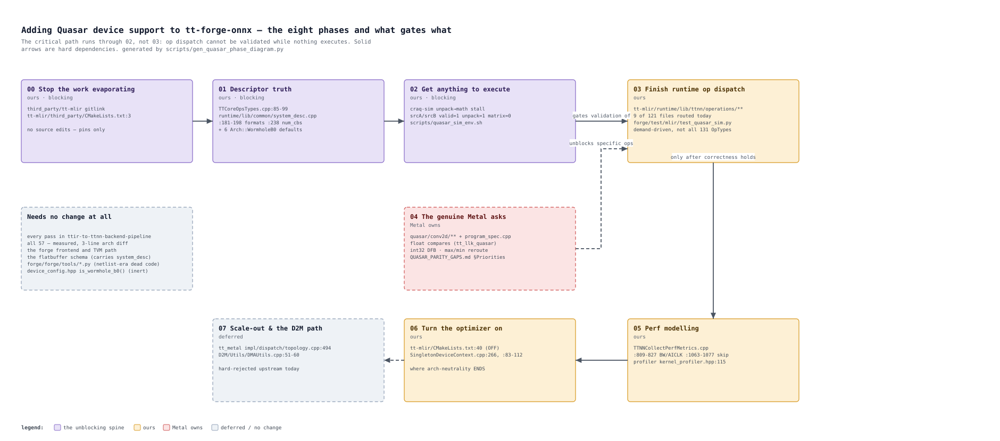
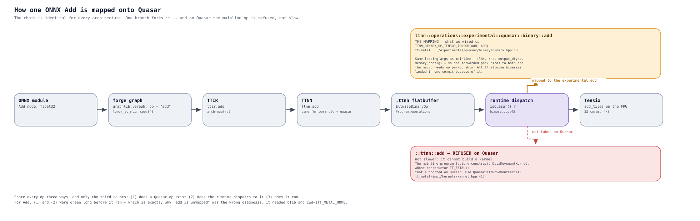

# Quasar

There is no Quasar silicon to plug in, so Quasar support in tt-forge-onnx is split
into two independent capabilities. Work out which one you need before reading further.

| I want to... | Use | Needs |
|---|---|---|
| Compile for Quasar from any machine | `MLIRConfig().set_target_arch(Arch.QUASAR)` | nothing |
| Compile against a specific real Quasar topology | `MLIRConfig().set_system_desc_path(...)` | a captured `.ttsys` |
| Actually **run** a graph on Quasar | craq-sim, the QSR simulator | a locally built `libttsim.so` |

## Compiling for Quasar with no device attached

By default forge reads the system descriptor off whatever device is physically
present, so the compile target is whatever hardware you happen to be sitting in front
of — and compiling with no hardware is impossible. Two `MLIRConfig` options move the
descriptor out of the device and into the compile request:

```python
import forge
from forge.config import CompilerConfig, MLIRConfig

cfg = CompilerConfig(mlir_config=MLIRConfig().set_target_arch(forge._C.Arch.QUASAR))
compiled = forge.compile(model, sample_inputs=inputs, compiler_cfg=cfg)
```

`set_target_arch` accepts `WORMHOLE_B0`, `BLACKHOLE` and `QUASAR` — the three the
`ttir-to-ttnn` pipeline has a mock descriptor for. It maps to the pipeline option
`mock-system-desc-arch=<arch>`.

When either option is set, `emit_mlir` skips stamping `ttcore.system_desc` on the
module, and tt-mlir's `TTCoreRegisterDevice` pass builds the descriptor from the
pipeline options instead — it only fabricates one when the module carries none. That
same skip is what avoids `TTSystem::get_system()`, which is the call that would
otherwise open a device.

Two caveats:

* The mock descriptor is **nominal**. It carries the arch's grid, L1 size and DRAM
  geometry, not a specific board's harvesting. Use `set_system_desc_path` when the
  real topology matters — see below.
* Quasar rejects `experimental_weight_dtype`. Its format set has no `bf8_b`/`bf4_b`,
  and without the guard in `mlir_config.cpp` the failure surfaces much later as a
  tt-metal host format-validator throw.

Covered by `forge/test/mlir/test_target_arch.py`, which the
`test-compile-arch-sub.yml` CI job runs on a plain runner with no accelerator. That
job is the only PR coverage for Quasar, since no Quasar runner exists.

### Capturing a real descriptor

`set_system_desc_path` needs a `.ttsys` flatbuffer. Capture one on the machine that
has the device — including a simulated one, so this is how you get a *real* Quasar
descriptor rather than the nominal mock:

```python
import forge

forge._C.runtime.experimental.save_system_desc("quasar_system_desc.ttsys")
```

This opens the attached device, which is the point. It is the equivalent of
`ttrt query --save-artifacts` without needing ttrt installed. Then, from anywhere:

```python
cfg = CompilerConfig(mlir_config=MLIRConfig().set_system_desc_path("quasar_system_desc.ttsys"))
```

`system_desc_path` wins over `target_arch` when both are set, mirroring the tt-mlir
pipeline where a non-empty `system-desc-path` beats `mock-system-desc-arch`.

## Running on the craq-sim simulator

craq-sim presents a virtual QSR device to UMD, so nothing on the forge side is
Quasar-specific: graphs go through the ordinary compile-and-verify path and land on a
device that happens to be simulated. It needs no emulator and no NDA hardware.

### Build the simulator

Public ttsim releases ship wormhole (`libttsim_wh.so`) and blackhole
(`libttsim_bh.so`) builds only. The Quasar one has to be built locally, from a
craq-sim checkout:

```bash
TT_VERSION=2 ./make.py src/_out/release_qsr/libttsim.so
```

### Run

```bash
source ./scripts/quasar_sim_env.sh          # QUASAR_SIM_DIR overrides the default path
pytest -svv forge/test/mlir/test_quasar_sim.py
```

The script stages the simulator, exports the environment, and sanity-checks that the
`.so` is really a QSR build — a stale wormhole/blackhole one loads far enough to be
confusing and then fails with `MissingSpecification: libttsim_pci_mem_wr_bytes`.

Two things it handles that are easy to get wrong by hand:

* **The SoC descriptor must be copied *and renamed*.** UMD derives the path from the
  `.so`'s parent directory and expects the generic name `soc_descriptor.yaml`
  (`get_soc_descriptor_path_from_simulator_path` in
  `umd/device/simulation/simulation_chip.cpp`). The arch-specific
  `quasar_32_arch.yaml` filename is never consulted.
* **Do not set `TT_METAL_MOCK_CLUSTER_DESC_PATH`.** It expects a cluster descriptor,
  which is a different schema; pointing it at the SoC descriptor makes UMD fail with
  "Invalid YAML". The script unsets an inherited value.

### Run Quasar tests in their own pytest process

tt-metal's `RunTimeOptions` (inside the `MetalContext` singleton) and forge's
`TTSystem` are both construct-once-per-process. **The first test to touch a device
fixes hardware-vs-simulator for the entire session**, and nothing can change it
afterwards. Mixing Quasar tests with ordinary ones would silently run one group
against the wrong target.

`forge/test/mlir/test_quasar_sim.py` is therefore deliberately left out of
`pytest.ini`'s `testpaths`, so a bare `pytest` never collects it. Its skip is decided
at collection time via a module-level `pytestmark`, not a fixture, because the root
conftest's autouse property-recorder fixture already probes the device and there is no
ordering guarantee that would let a fixture here run first.

### Open blocker: the math unit never consumes its operands

`test_add` does not complete. Compilation is fine (~9 s); execution wedges. The
simulator's Tensix detail telemetry, read in full:

```
T0.X0.P1 rd=6 wr=20 inst=0xa6a12010 wait=0x2 sync=0x45 fifo=14
  srcA={valid=0x1 unpack=1 matrix=0}  srcB={valid=0x1 unpack=1 matrix=0}
  stallwait={active=0 was=0 lag=0 wait=0x0 stall=0x0}
  semwait={active=0 was=0 waiting=0 lag=0 sel=0x0 cond=0x0 stall=0x0}
  sem=[0,0,0,0,0,0,0,0]   semmax=[0,2,0,0,2,0,0,0]
```

Four pipes are stuck, symmetrically: `T0.X0.P1`, `T0.X0.P2`, `T8.X0.P1`, `T8.X0.P2`
— which is the `pending_tensix=4` seen in the heartbeat.

**It is not a semaphore stall**, despite the head instruction being one. Opcode `0xA6`
is `SEMWAIT`, but `semwait.active=0` means it was never latched, `sel` and `cond` are
both `0`, and every semaphore reads `0` against maxima of `2` — nothing is at max, so
no semaphore wait *could* be blocking. `stallwait.active=0` rules that out too. The
whole run also records zero `sempost` and zero `semget` events, only four `seminit`s,
so the kernel never reaches the producer/consumer handshake at all.

What is actually true: `srcA` and `srcB` are both `valid=1, unpack=1, matrix=0`. The
unpacker delivered both operands into the unpack bank, and **the matrix/math unit never
took them**. The pipes are held by a wait gate — `wait=0x2` is `wait_gate_mask` and
`sync=0x45` is `ttsync_resources` (`craq-sim/src/libttsim.cpp:1621`, argument list at
`:1629`) — i.e. an unmet TTSync resource dependency, not a semaphore.

Guards that stay silent, and why:

* `TTSIM_HANG_WATCHDOG_CLOCKS` does not fire — correctly. The RISC-V cores keep
  retiring instructions in their poll loop, which its documentation explicitly excludes.
* `no_progress_chip_cycles` stays pinned at 129 from the first heartbeat, so the
  aggregate counter reads healthy for the whole run.

Ruled out by measurement, not assumption:

| Hypothesis | Result |
|---|---|
| Just slow — needs a longer budget | No. 360M clocks / 35 min, every counter frozen |
| Experimental parallel-clocking knobs | No. Identical signature with and without |
| Unimplemented opcode in the simulator | No. `SEMPOST`/`SEMGET`/`SEMINIT`/`SEMWAIT` all have real Quasar executors |
| A semaphore never posted | No. `semwait.active=0`, all semaphores below max |
| cwd not `$TT_METAL_HOME` (relative kernel include path) | No. Same stall from `$TT_METAL_HOME` |

**Next step:** `TTSIM_STALLWAIT_TRACE` and `TTSIM_TENSIX_STALL_TRACE` (with their
`_TILE` / `_CHIP` filters) to identify which wait-gate resource in `ttsync_resources`
never clears, plus `TTSIM_TRACE_SRC_VALID` for the unpack-to-math handoff. This sits
below forge and below tt-mlir — it is Tensix execution — so a pin bisect is the fallback
if the traces come back clean, not the first move.

This contradicts an earlier recorded measurement of Add/Mul/Sub/Div passing on craq-sim,
which predates the current tt-mlir and tt-metal pins.

### It is slow, and there are levers

Expect a cycle-accurate simulator to be slow, and budget **hours, not minutes** —
craq-sim's own Quasar op CI allows 240 minutes per run. Execution, not compilation,
dominates completely: a single-op ONNX graph compiles for Quasar in about 9 seconds and
then spends the rest of the run executing, at roughly 10^5 simulated clocks/sec.

The practical consequence is that a wall-clock timeout under an hour will kill a healthy
run, and a killed run looks exactly like a hang. Set the budget from the CI figure, not
from how long you are willing to wait.

A stack sample of a run that looks stuck usually shows

```
libttsim_clock_all_devices (libttsim.so)
tt::umd::TTSimTTDevice::after_read (libtt-umd.so)
```

which is the host polling a completion flag, with each poll clocking simulated time
forward. That is forward progress, not a deadlock — `py-spy dump --pid <pid> --native`
is the quickest way to tell the two apart, and it also distinguishes "still compiling"
from "executing on device".

Keep the Quasar test file small for this reason. The accelerator knobs below are the
lever if runtime becomes the blocker. Check what your `libttsim.so` actually reads
before setting any of them — craq-sim's README documents `*_DRAM_TELEPORT` and
`*_L1_TELEPORT` too, but neither is present in the QSR build here:

```bash
strings "$TT_METAL_SIMULATOR" | grep '^TT_METAL_SIMULATOR'
```

| Variable | Effect |
|---|---|
| `TT_METAL_SIMULATOR_PARALLEL_TENSIX_TILE_CLOCK=1` | clock whole Tensix tiles in parallel |
| `TT_METAL_SIMULATOR_PARALLEL_CLOCK_THREADS=N` | cap on parallel clock lanes (`0`/unset = auto, `1` = serial) |
| `TT_METAL_SIMULATOR_PARALLEL_CHIP_CLOCK=1` | clock multiple simulated chips in parallel |
| `TT_METAL_SIMULATOR_CQ_WAIT_CLOCKS=N` | clock pumping while waiting on command-queue progress |

`quasar_sim_env.sh` deliberately sets **none** of them. They are marked experimental
opt-in upstream and were documented against a fast-dispatch Blackhole run rather than
slow-dispatch Quasar, so turning them on by default would change results on a guess.
Set them explicitly after sourcing the environment, and re-check numerics when you do.

### Debugging a hang

An unresponsive simulated core spins at 100% CPU indefinitely with no output at all —
indistinguishable from "still simulating", which on a cycle-accurate simulator is
genuinely slow. `quasar_sim_env.sh` sets two variables that make the difference visible.
Both are read by `libttsim.so` itself, so they work with any tt-metal:

| Variable | Effect |
|---|---|
| `TTSIM_HANG_WATCHDOG_CLOCKS=N` | fails the run after `N` simulated clocks with pending work but no RISC-V progress and no Tensix retirement |
| `TTSIM_PROGRESS_HEARTBEAT_CLOCKS=N` | prints chip-cycle progress, active RISC-V PCs, pending Tensix FIFOs and outstanding NoC counts every `N` clocks |

The watchdog classifies **true deadlocks** only. A firmware loop that keeps retiring
instructions is not "hung" by that definition, so still wrap long runs in a wall-clock
`timeout`.

Note that tt-metal's own `TT_METAL_SIM_CORE_WAIT_TIMEOUT_MS` is *not* an alternative
here: it lives on the unpinned `quasar-sim-core-wait-diagnostic` branch and is inert
against the pinned tt-metal. The two TTSIM variables above supersede it and need no
tt-metal patch at all.

## Where the arches actually differ

Measured, not assumed. `ttmlir-opt --dump-pass-pipeline` expands the pipeline without a
device, so the two targets can be compared directly:

```bash
cd third_party/tt-mlir
for a in wormhole_b0 quasar; do
  ./build/bin/ttmlir-opt --ttir-to-ttnn-backend-pipeline="mock-system-desc-arch=$a" \
    --dump-pass-pipeline /tmp/empty.mlir > /tmp/pipe_$a.txt 2>&1
done
diff /tmp/pipe_wormhole_b0.txt /tmp/pipe_quasar.txt
```

**The two pipelines are structurally identical** — 147 lines each, the same 7 top-level
passes, the same 25 TTIR and 25 TTNN passes in the same order with the same options. The
diff is exactly three lines: the `mock-system-desc-arch` value, the resulting
`#ttcore.system_desc`, and the `ttcore.device` derived from it.

So **no compiler pass needs a Quasar change.** Arch-dependence enters only as numbers in
the system descriptor and then propagates by arithmetic; it becomes behavioural only at
runtime op dispatch. The branch contents say the same thing independently — of the 15
files the tt-mlir bringup branch touches, 13 are under `runtime/lib/ttnn/`, and the two
that are not are the mock descriptor and a *skip* in `TTNNCollectPerfMetrics`.

Note `ttmlir-opt --help` segfaults on this build. Enumerate passes with
`--dump-pass-pipeline`.

### The descriptor, side by side

From `createDefaultWormholeSystemDesc` and `createDefaultQuasarSystemDesc`
(`lib/Dialect/TTCore/IR/TTCoreOpsTypes.cpp:282` and `:43`). 16 of 21 chip-descriptor
fields differ:

| Field | Wormhole B0 | Quasar |
|---|---|---|
| `grid` | 8x8 (64 workers) | **4x8 (32 workers)** |
| `l1_size` | 1 499 136 | **4 194 304** |
| `num_dram_channels` / `dram_grid` | 12 / 1x12 | **2 / 1x2** |
| `num_cbs` | 32 | **64** |
| `num_compute_threads` | 1 | **4** |
| `num_datamovement_threads` | 2 | **6** |
| `coord_translation_offsets` | 18x18 | **2x2** |
| `pcie` / `noc_dram` align bytes | 32 / 32 | **64 / 64** |
| `l1_unreserved_base` | 1 024 | **313 088** |
| `erisc_l1_unreserved_base` | 1 024 | **88 576** |
| `dram_unreserved_base` / `_end` | 1 024 / 1 073 741 824 | **1 048 704 / 1 068 732 416** |
| `dram_bank_to_logical_worker_noc0/1` | 12 entries | **empty** |
| `dram_channel_size` | 1 GiB | 1 GiB |
| `noc_l1_address_align_bytes` | 16 | 16 |
| `dst_physical_size_tiles` | 16 | 16 |
| `supported_data_types` | 13 types | **5** (f32, f16, bf16, u8, si32) — *fixed, see below* |
| `supported_tile_sizes` | 6 sizes | identical |

Cross-checked against `tt-metal/tt_metal/soc_descriptors/quasar_32_arch.yaml` (10x8 NOC
grid, 32 workers at `2-2 … 9-5`, `worker_l1_size: 4194304`, 2 DRAM banks of 1 GiB): the
mock matches the real SoC descriptor.

### Three things in that table worth knowing

**The empty DRAM-bank vectors are deliberate.** Not a gap in the mock. The live builder
skips `get_optimal_dram_bank_to_logical_worker_assignment()` for Quasar
(`runtime/lib/common/system_desc.cpp:205-221`) because Quasar has a single NoC —
`getDmCoreDefaultNoc()` returns NoC0 for every DM core (`lib/Dialect/TTCore/IR/Utils.cpp:54-63`).

**`supported_data_types` used to claim Quasar supported block-float. Fixed 2026-09-07.**

Both descriptor paths advertised Wormhole's exact 13-format list for Quasar, including
`bfp_bf8`, `bfp_bf4`, `u16` and `u32`. The live builder was no better than the mock: its
own comment read *"The following is temporary place-holder value to be replaced by API
value."* So the two agreed with each other while neither was authoritative, and anything
consulting `supportedDataTypes` for legality believed bfp8 was available on Quasar — the
failure only surfacing much later as a tt-metal host format-validator throw.

tt-metal already had the authoritative answer:
`tt::is_data_format_supported(format, arch)`
(`tt_metal/common/tt_backend_api_types.cpp:126`, dispatching to `is_supported_quasar` at
`:97`, declared in the public header `tt-metalium/tt_backend_api_types.hpp:72`). Quasar
excludes `Bfp2/Bfp4/Bfp8` and their `_b` variants — its narrow formats are MX
(microscaling) — and has no unsigned 16/32-bit device format; its 32-bit formats are
`Float32` and `Int32`.

The fix, on `lelanchelian/quasar-forge-onnx-bringup`:

* `runtime/lib/common/system_desc.cpp` — the live builder now enumerates all 13
  `target::DataType` values, maps each to its `tt::DataFormat`, and keeps the ones
  `is_data_format_supported` admits for `device->arch()`. It is no longer a hardcoded
  list, and it is arch-correct for every arch rather than just for Wormhole.
  (`common.h`'s `toDataFormat` is deliberately not reused: it covers only a subset and
  `LOG_FATAL`s on the rest.)
* `lib/Dialect/TTCore/IR/TTCoreOpsTypes.cpp` — `createDefaultQuasarSystemDesc` now
  carries the matching 5-entry set, so device-free compiles agree with the device.

Verified on all four combinations — Quasar mock, Quasar live on craq-sim, Wormhole mock,
Wormhole live on silicon:

| Descriptor | formats | block-float |
|---|---|---|
| wormhole mock | 13 | yes |
| wormhole live (silicon) | 13 | yes |
| quasar mock | 5 | no |
| quasar live (craq-sim) | 5 | no |

Mock and live now agree exactly for both arches, on all 22 chip-descriptor fields.

Two things this does **not** change. `supported_tile_sizes` is still a hardcoded
placeholder in both paths — tt-metal exposes no per-arch tile-size query, and guessing
would be worse than reporting the common set. And forge's guard at
`mlir_config.cpp:155-165` is left in place: it still gives a better error, earlier, than
a descriptor-driven legality failure would.

**`num_cbs` is wrong for Wormhole, and right for Quasar by accident.** The mock says 32 for
Wormhole and 64 for Quasar, but the live builder passes the compile-time
`NUM_CIRCULAR_BUFFERS` (`runtime/lib/common/system_desc.cpp:238`), which is 64 on a host
build regardless of arch — `circular_buffer_constants.h:27-39` only special-cases the
device-side `ARCH_WORMHOLE` define, and its own comment says to call
`hal::get_arch_num_circular_buffers()` instead. A live Wormhole run therefore reports 64
CBs where `mock-system-desc-arch=wormhole_b0` reports 32.

None of the three is fixed here — each is a tt-mlir change on a pinned branch.

### Every arch default is Wormhole

Omitting `mock-system-desc-arch` does not fail, it silently compiles for Wormhole:
`TTNNPipelines.h:212`, `D2MPipelines.h:55`, `Passes.td:62`, `Transforms.h:15`,
`TTCoreOpsTypes.td:231` and `TTCoreRegisterDevice.cpp:46` all default to
`Arch::WormholeB0`.

`DeviceConfig::is_wormhole_b0()` also returns **true** for Quasar
(`device_config.hpp:225`, "temporarily treat them as equivalent"), but check the blast
radius before treating that as a bug: it has exactly two call sites, both inside
`device_config.hpp` — the legacy constructor's backend queries at `:105`, themselves
gated on `backend_type == "silicon"`, and `supports_stochastic_rounding()` at `:403`,
which has **no callers at all**. Nothing on the MLIR compile path reads it. It is an
onboarding shim with no live consumers, not a live hazard.

One structural consequence worth recording: `D2M → TTMetal/TTKernel` lowering hard-errors
on Quasar (`lib/Dialect/D2M/Utils/DMAUtils.cpp:51-60`), so **only the TTNN path is
viable** — which is the path forge takes anyway.

### Phases, and what gates what



The ordering is the part worth internalising, because the intuitive one wastes effort.
**The critical path runs through phase 02 (execution), not phase 03 (op dispatch).** You
can compile a Quasar binary for any op today; you cannot tell a correct one from a wrong
one until a graph actually runs, so dispatch work done before that is unverifiable.

Phase 06 is the one that contradicts the section above: every pass is arch-neutral
*today* only because `TTMLIR_ENABLE_OPMODEL` defaults OFF
(`third_party/tt-mlir/CMakeLists.txt:40`), so nothing performs sharding or L1 layout
selection and everything lands DRAM-interleaved at optimization level 0. Quasar's 4 MiB
L1 — 2.8x Wormhole's — is not exploited at all. Turning the optimizer on is where
genuine arch-aware compiler work begins.

Regenerate with `python scripts/gen_quasar_phase_diagram.py`. Like the pipeline diagram
it is a diagrams.net document as well as an image, and it checks every source anchor it
quotes before writing.

### The picture

`docs/source/imgs/compiler_arch/forge-onnx_overview.drawio.svg` draws all of the above:
the single-op path pass by pass, the hardware-spec lane, and a Quasar badge on every
stage. Regenerate it with `python scripts/gen_pipeline_diagram.py` after a pin bump — the
pass list is read from the real pipeline, and the generator warns if the wormhole/quasar
diff stops being those three lines.

## Op status

Score each op three ways; only the third counts:

1. does it exist under `ttnn/.../experimental/quasar/`
2. does the tt-mlir runtime dispatch forge's op to it
3. does it actually run

Most "op X is broken on Quasar" turns out to be "Quasar's op X falls through to the
*mainline* op X", which is refused rather than merely slow: mainline program factories
construct `DataMovementKernel`, whose constructor `TT_FATAL`s on Quasar with "Use
QuasarDataMovementKernel instead". Attribute from the stack, not the test name.

| Op | Status |
|---|---|
| Add, Mul, Sub, Div | run and verify |
| relu | runs and verifies (PCC 0.95), but *rewritten*, not dispatched — see below |
| to_layout, reshape, transpose/permute, reductions, pools, linear, matmul | dispatched to the Quasar op library |
| Greater / Less / Equal / GE | **blocked, Metal ask** — but be precise: Quasar *does* have compare SFPU (`hw/ckernels/quasar/.../llk_math_eltwise_binary_sfpu_binary_comp.h`), Int32 only by `static_assert`. It is the **float** compares that are unported, listed as such in Metal's own `QUASAR_PARITY_GAPS.md:93`. Forge's ONNX comparisons are float, so they hit the unported path. |
| conv2d | **blocked, Metal ask** — `conv_bmm_tilize_metal2` deadlock, tt-metal #48552 |

The two genuine asks for Metal are conv2d and a unary path; everything else that fails
is dispatch work on our side.

relu is worth calling out because it is the one op with no dispatch target at all:
Quasar has no unary family under `experimental/quasar/`, only binary and binary_ng. It
is emitted as `add(x, 0)` with relu fused as an LHS activation — `relu(x) + 0 ==
relu(x)`, and adding `0.0f` is exact in bf16. `max(x, 0)` was tried first and fails,
because Quasar's tensor-scalar maximum runs on the unary clamp path and delegates
straight back to mainline `ttnn::prim::unary`. This is the correctness fix, not the
performance one: the hand-written Quasar ResNet-50 folds relu into the preceding
add/conv and removes the op entirely, which needs a binary+activation pattern in
tt-mlir's fusing pass that does not exist yet.

## How an op is actually mapped



Worth internalising because it is the shape of *every* op mapping, not just add's.
Compilation is arch-neutral, so the same `ttnn.add` reaches the runtime for every
target; a single branch then picks the implementation:

```cpp
#define RUN_ELTWISE_BINARY(NAME)                                          \
  runEltwiseBinaryOp(op, tensorPool, [](auto &&...args) {                 \
    return utils::isQuasar()                                              \
               ? ::ttnn::operations::experimental::quasar::binary::NAME(  \
                     std::forward<decltype(args)>(args)...)               \
               : ::ttnn::NAME(std::forward<decltype(args)>(args)...);     \
  })
```

The swap is one line because the Quasar entry point takes the same leading arguments
as the mainline op — `(lhs, rhs, output_dtype, memory_config)` — so one forwarded
parameter pack binds to both and no per-op shim is needed. That is why all 14 eltwise
binary ops landed in a single commit. Where the signatures diverge, as for conv2d and
matmul's program configs, the swap does not work and the op needs real handling.

The `false` branch is drawn dashed because on Quasar it is **refused, not slow**: the
mainline program factory constructs a `DataMovementKernel`, whose constructor
`TT_FATAL`s with *"not supported on Quasar. Use QuasarDataMovementKernel instead"*
(`tt_metal/impl/kernels/kernel.hpp:417`). That refusal is the entire reason
`isQuasar()` exists.

Score any op three ways, and only the third counts. For add: (1) a Quasar op exists,
(2) the runtime dispatches to it, (3) it depends on how it is driven. From tt-metal
directly it **passes** — 4/4 ResNet-50 residual-add shapes on craq-sim, bf16, TILE,
HEIGHT_SHARDED in L1 across the 8x4 = 32-core grid, with a fused RELU. From forge it
wedges, and forge emits something quite different: f32, DRAM, INTERLEAVED, a 1x1 grid.
Since (1) and (2) are both green, "add is unmapped" is the wrong diagnosis.

Regenerate with `python scripts/gen_add_mapping_diagram.py`.

## Where Quasar support lives, and how it gets lost

Quasar support is **not** in tt-mlir or tt-metal `main`. It lives on branches that
`third_party/tt-mlir` is pinned to:

| Repo | Branch | Carries |
|---|---|---|
| tt-mlir | `lelanchelian/quasar-forge-onnx-bringup` | the Quasar mock system descriptor, the `TTNNCollectPerfMetrics` skip, and the TTNN runtime op dispatch |
| tt-metal | `lelanchelian/quasar-forge-onnx-op-slicing` | the Quasar `to_memory_config` fix and the `scaleout_tools` PCH patch |
| tt-metal | `lelanchelian/quasar-sim-core-wait-diagnostic` | `TT_METAL_SIM_CORE_WAIT_TIMEOUT_MS` (not pinned) |

At the previous pin, `createDefaultQuasarSystemDesc` returned **zero chip
descriptors**, so `mock-system-desc-arch=quasar` could not compile anything, and
`TTNNCollectPerfMetrics` emitted a hard error for arch `quasar`. Both fail the compile
rather than degrading.

> **Hazard.** Both the parent build and the tt-mlir build force-checkout their
> submodules and `ExternalProject` to the pinned SHAs. This has already silently
> reverted the Quasar work once, leaving a built `ttmlir-opt` whose behaviour no source
> on disk explained. If you edit tt-mlir or tt-metal in place, be on a **named, pushed**
> branch, and bump the pin.

Pins to bump when the branches move:

* tt-metal: `TT_METAL_VERSION` in `third_party/tt-mlir/third_party/CMakeLists.txt`.
  For local iteration, `-DTTMLIR_TTMETAL_SOURCE_DIR=<path>` overrides it and skips the
  `GIT_TAG` enforcement.
* tt-mlir: the `third_party/tt-mlir` gitlink in this repo.
